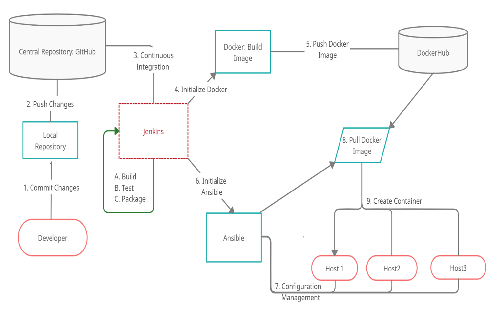

Scientific Calculator with Devops:

Following are the functionalities which are currently available:

	1. Square Root

	2. Factorial

	3. Power function

	4. Factorial

The Software is build with the help of DevOps methodology where each commit of code goes through automated build and test, which is then deployed at the end user.

DevOps Stack:

Build: Maven

Test: Junit

Continuous Integration: Jenkins

Continuous Delivery: Docker

Configuration Management: Ansible

Continuous Deployment: Ansible

Continous Monitoring: Log4j2 and ELK.

The Complete process is explained in the image below:

